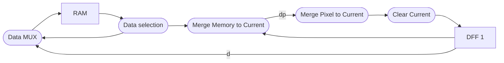
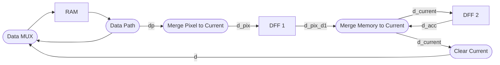

# Optimizing critical path for Feature Accumulator.

## Original design

In the original design, the longest asynchronous datapath is from memory to DFF inside Feature Accumulator.

This datapath consists of:
- Data selection (Data selection)
- Merging feature from memory to current feature in Feature Accumulator register (Merge Memory to Current).
- Merging feature from current pixel to current feature in Feature Accumulator register (Merge Pixel to Current).
- Clearing the feature to a empty collection (Clear Current).

## Optimized design.

Here the idea is that the order of feature merging does not matter, and the loop from `DFF 1` to `Merge Memory to Current` can be made shorter.

Now the longest asynchronous datapath is either `Data selection`-`Merge Pixel to Current`
or `Merge Memory to Current`-`Clear Current`-`Data Mux`.

